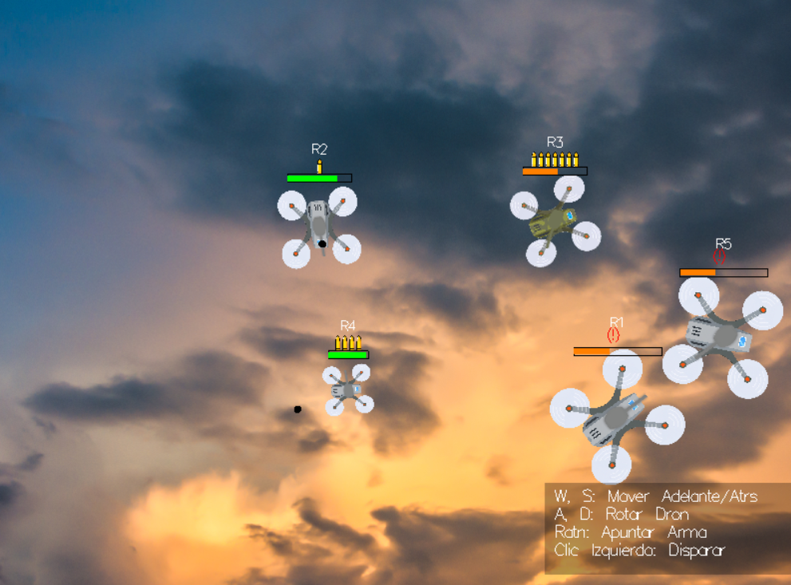

# Torneo de Robots en Haskell

Este proyecto es una simulación de un torneo de batalla de robots (bots) 2D, desarrollado íntegramente en Haskell utilizando la biblioteca `gloss` para el renderizado y la gestión del bucle de juego.

En esta arena, múltiples robots controlados por diferentes IA o por un jugador humano compiten entre sí. Cada robot está equipado con un chasis para moverse, una torreta para apuntar y un radar para detectar enemigos. El objetivo es ser el último robot en pie. El juego incluye un menú de configuración para personalizar la partida.


---

## Índice

- [Características Principales](#características-principales)
- [Dinámicas del Juego](#dinámicas-del-juego)
  - [Tipos de Robots](#tipos-de-robots)
  - [Inteligencia Artificial (IA)](#inteligencia-artificial-ia)
  - [Control del Jugador](#control-del-jugador)
  - [Power-ups](#power-ups)
  - [Obstáculos](#obstáculos)
  - [Física y Colisiones](#física-y-colisiones)
  - [Bucle Principal del Juego](#bucle-principal-del-juego)
- [Estructura del Proyecto](#estructura-del-proyecto)
- [Cómo Ejecutar el Juego](#cómo-ejecutar-el-juego)
- [Posibles Mejoras Futuras](#posibles-mejoras-futuras)

---

## Características Principales

* **Renderizado 2D con Gloss:** Utiliza `gloss` para dibujar todos los elementos: mapa, robots (chasis y torreta), proyectiles, explosiones, power-ups, UI (barras de vida, munición, nombres, controles).
* **Carga de Assets:** Carga imágenes `.png` y `.jpg` usando `gloss-juicy`.
* **Menú Interactivo:** Permite configurar la partida: añadir/eliminar robots (hasta 5), seleccionar tipo de chasis, asignar comportamiento de IA, designar un robot como jugador, activar/desactivar power-ups y cambiar la resolución.
* **Control del Jugador:** Un robot puede ser controlado por el jugador mediante teclado (WASD) y ratón (apuntar/disparar).
* **IA Modular:** Incluye múltiples comportamientos (Agresivo, Equilibrado, Defensivo, Pacífico, Embestidor) y utiliza memoria para recordar la última posición enemiga vista e investigarla.
* **Sistema de Físicas:**
  	* Movimiento de robots y proyectiles con velocidad y rotación.
  	* Colisiones con los bordes del mundo (rebote).
* **Detección Avanzada de Colisiones (SAT):**
  	* **Robot-Proyectil:** Detección precisa para aplicar daño.
  	* **Robot-Robot:** Detección mediante el **Teorema de Ejes Separadores (SAT)** para prevenir solapamiento, aplicar daño por colisión (basado en peso y tipo RAMMER) y aplicar físicas de empuje (push-back).
  	* **Robot-PowerUp:** Detección por proximidad (radio).
  	* **Robot-Explosión:** Detección por radio para aplicar daño en área.
* **Sistema de Combate:**
  	* Salud, daño, cadencia de tiro, capacidad del cargador y tiempo de recarga variables según el tipo de robot.
  	* Sistema de *cooldowns* (disparo, daño por colisión), recarga de munición y efectos visuales (parpadeo por daño).
  	* Explosiones visuales al destruir un robot o impactar un proyectil.
* **Power-ups:** Objetos recolectables que otorgan ventajas temporales (salud, munición extra, velocidad, escudo).
* **Fin de Partida:** Detecta cuándo queda un solo robot o ninguno y muestra una pantalla de "Game Over" con el ganador o indicando empate.

---

## Dinámicas del Juego

### Tipos de Robots

Existen tres clases de robots, cada una con estadísticas distintas (definidas en `Entities.hs`):

| Tipo | Salud Máx. | Vel. Máx. | Daño Proy. | Cooldown Disparo | Rotación Torreta | Rotación Chasis | Peso | Cargador | Recarga |
| :--- | :---: | :---: | :---: | :---: | :---: | :---: | :--: | :---: | :---: |
| LIGHT | 80.0 | 78.0 | 4.0 | 30 frames | Rápida (0.1) | Rápida (0.07) | 1.0 | 10 | 90 fr |
| MEDIUM | 100.0 | 60.0 | 9.0 | 50 frames | Media (0.07) | Media (0.05) | 2.5 | 7 | 120 fr |
| HEAVY | 120.0 | 42.0 | 16.0 | 70 frames | Lenta (0.03) | Lenta (0.02) | 4.0 | 3 | 180 fr |

### Inteligencia Artificial (IA)

La IA (definida en `IA.hs`) controla a los robots no jugadores.

1. 	**Prioridades:** La IA primero evalúa si ir a por un power-up (`shouldGoForPowerUp`) comparando su distancia con la del enemigo más cercano al objeto.
2. 	**Detección:** Usa `radarLength` para buscar al enemigo vivo más cercano (`findClosestEnemy`).
3. 	**Memoria e Investigación:** Si un enemigo detectado se pierde de vista, la IA guarda su última posición conocida (`last_seen_pos` en `robotMem`) y se dirige hacia ella (`investigateOrWander`). Si llega cerca sin encontrarlo, olvida la posición y vuelve a deambular.
4. 	**Navegación:**
  	* **Wander (Deambular):** Si no hay enemigo visible ni posición que investigar, deambula (`wanderActions`), usando memoria y un temporizador para giros periódicos.
  	* **Evitar Paredes:** Inicia una maniobra de evasión (retroceder y girar) si se acerca a un borde (`isNearWall`) o si su camino está bloqueado (`isPathBlocked`).
  	* **Desatasco:** Si el robot permanece quieto (velocidad "casi cero") por más de `stuckTimeThreshold` (1 segundo), activa una maniobra de desatasco forzado (moverse atrás/adelante y girar).
5. 	**Comportamientos de Combate:**
  	* **`AGGRESSIVE`**: Persigue activamente (`actionsToMoveTowards`), apunta y dispara (`actionsToAimAndFire`). Guarda la posición del enemigo si lo ve.
  	* **`BALANCED`**: Se detiene, apunta y dispara. No persigue, pero sí investiga si pierde al enemigo.
  	* **`DEFENSIVE`**: Apunta y dispara. Si el enemigo está muy cerca (50% del radar), retrocede mientras dispara. Investiga si pierde al enemigo.
  	* **`PEACEFUL`**: Deambula o va a por power-ups. Ignora y nunca ataca a los enemigos. Borra la memoria de posiciones.
  	* **`RAMMER`**: **Nunca dispara**. Prioriza perseguir enemigos de peso igual o inferior. Si no hay, persigue al más cercano. Guarda su posición para investigar.

### Control del Jugador

Si se designa un robot como `PLAYER` en el menú de configuración:

* **W, S:** Mover chasis adelante/atrás.
* **A, D:** Rotar chasis izquierda/derecha.
* **Movimiento del Ratón:** Apuntar la torreta hacia el cursor.
* **Clic Izquierdo:** Disparar (sujeto a cooldown, munición y recarga).

Una UI simple en la esquina inferior derecha recuerda estos controles.

### Power-ups

Si están habilitados en el menú, aparecen periódicamente en el mapa.

* **Aparición:** Cada `powerUpSpawnInterval` (5 segundos), un power-up de tipo aleatorio aparece en una posición aleatoria que no colisione con obstáculos.
* **Duración:** Permanece `powerUpDuration` (20 segundos) en el mapa antes de desaparecer y reiniciar el temporizador de aparición.
* **Recogida:** Un robot lo recoge al pasar cerca (suma de radios).
* **Tipos (`Entities.hs`):**
  	* **`Health`**: Restaura `healthPackAmount` (35) de vida (hasta el máximo).
  	* **`AmmoBoost`**: Añade `ammoBoostAmount` (5) balas al cargador (hasta 2x tamaño máx.).
  	* **`SpeedBoost`**: Aumenta la velocidad máxima por `speedBoostFactor` (x2.0) durante `speedBoostDuration` (7s).
  	* **`Shield`**: Otorga invulnerabilidad al daño durante `shieldDuration` (10s).

### Obstáculos

El campo de batalla no está vacío. Al iniciar la partida, se generan **15 obstáculos** (`numObstacles` en `Game.hs`) aleatorios en posiciones que respetan un margen con los bordes y una separación mínima entre ellos y las posiciones iniciales de los robots.

La generación de obstáculos (`startGameFromConfigs` en `Game.hs`) tiene las siguientes probabilidades:

* **Pared (WALL):** 45% 
* **Zona de Daño (DAMAGE\_ZONE\_RECT):** 15% 
* **Zona de Daño (DAMAGE\_ZONE):** 15% 
* **Zona de Tormenta (STORM\_ZONE):** 15% 
* **Mina (MINA\_INACTIVA):** 7% 
* **Torre Tesla (TORRE\_TESLA):** 3% 

Cada tipo de obstáculo tiene un comportamiento único:

* **`WALL` (Pared)**
  	* **Apariencia:** Un muro rectangular (`wall.png`).
  	* **Interacción:** Es un objeto sólido.
  	* **Bloquea el movimiento** de los robots. La física incluye lógica de "deslizamiento" para que los robots no se queden atascados al rozarlos (`Logic.hs`, `updatePosition`).
  	* **Bloquea proyectiles**, destruyéndolos y creando una explosión al impacto (`Physics.hs`, `detectProjectileObstacleCollisions`).

* **`DAMAGE_ZONE_RECT` (Zona de Daño Rectangular)**
  	* **Apariencia:** Una zona de peligro rectangular (`damage_zone_rect.png`).
  	* **Interacción:** **No bloquea el movimiento** de robots.
  	* Los robots que entran en contacto con ella reciben daño (`Logic.hs`, `resolveCollision`).
  	* **Bloquea proyectiles**, destruyéndolos al impacto.

* **`DAMAGE_ZONE` (Zona de Daño Circular)**
  	* **Apariencia:** Una zona de peligro circular (`damage_zone.png`).
  	* **Interacción:** **No bloquea el movimiento** de robots.
  	* Causa el mismo daño que la zona rectangular.
  	* **No bloquea proyectiles**; la atraviesan sin efecto.

* **`STORM_ZONE` (Zona de Tormenta)**
  	* **Apariencia:** Una nube circular y semitransparente (`tormenta.png`).
  	* **Interacción:** **No bloquea el movimiento** de robots.
  	* Los robots que entran en contacto reciben un *debuff* de ralentización (`"stormSlow"`) que dura 30 frames y reduce su velocidad máxima en un 35% (`Logic.hs`, `applyStormSlow` y `updateVelocity`).

* **`MINA_INACTIVA` / `MINA_ACTIVA` (Mina)**
  	* **Apariencia:** Circular. Comienza como `mina_inactiva.png`. Al ser pisada, cambia a `mina_activa.png` y parpadea (`Main.hs`).
  	* **Interacción:**
  	 	1. 	**Inactiva:** No hace nada. Si un robot la toca, se activa.
  	 	2. 	**Activa:** El obstáculo cambia su tipo a `MINA_ACTIVA` e inicia una cuenta atrás de 120 frames (2 segundos) (`Logic.hs`, `resolveCollision`).
section {
  	 	3. 	**Explosión:** Cuando el contador llega a 0 (`resolveExplodingMines`), la mina se elimina y genera una explosión (`crearExplosionDeMina`) en su lugar, con un radio 1.5 veces mayor que la propia mina.

* **`TORRE_TESLA` (Torre Tesla)**
  	* **Apariencia:** Una torre circular estática (`torre_tesla.png`).
  	* **Interacción:** Tiene un comportamiento doble:
  	 	1. 	**Sólida:** Al igual que un `WALL`, **bloquea el movimiento** de robots 	y **destruye proyectiles** al impacto (`Physics.hs`).
_TESLA` (Torre Tesla)**
  	* **Apariencia:** Una torre circular estática (`torre_tesla.png`).
  	* **Interacción:** Tiene un comportamiento doble:
  	 	1. 	**Sólida:** Al igual que un `WALL`, **bloquea el movimiento** de robots 	y **destruye proyectiles** al impacto (`Physics.hs`).
  	 	2. 	**Ataque:** Cada 60 frames (`teslaCooldown`), escanea en un radio de 220.0 (`teslaRange`). Si detecta robots, ataca al más cercano (`Logic.hs`, `updateTeslaTowers`).
  	 	3. 	**Efecto:** El ataque inflige 4.0 de daño (`teslaDamagePerShot`) y aplica un *debuff* de ralentización (`"teslaSlow"`) que dura 30 frames y reduce la velocidad máxima en un 15% (`Logic.hs`, `updateVelocity`, `updateTeslaTowers`).
  	* **Visualización:** Cuando ataca, `Main.hs` dibuja un rayo azul (`drawTeslaBeams`) desde la torre hasta el objetivo. Si la opción "Mostrar Hitboxes" está activa, se dibuja su radio de ataque.

#### Interacción General con Obstáculos

* **Daño por Contacto:** Cuando un robot toca una `DAMAGE_ZONE` o `DAMAGE_ZONE_RECT`, recibe daño (`obstacleDamageAmount`) , pero también obtiene una breve inmunidad de 20 frames (`obstacleCollisionCooldown`) *específicamente* contra el daño de obstáculos. Esto evita que reciba daño en cada frame si permanece sobre la zona.
* **Escudos:** El power-up de **Escudo** (`Shield`) anula completamente todo el daño proveniente de obstáculos (Zonas de Daño, Minas y Torres Tesla) (`Logic.hs`, `applyDamageIfMatch`, `applyObstacleDamageIfMatch`).

---

### Física y Colisiones

Gestionadas principalmente en `Physics.hs` (detección) y `Logic.hs` (resolución).

* **Movimiento:** Actualización simple de posición: `posición + velocidad * dt`. La velocidad se aplica según las acciones (`applyAction`). Se aplica fricción (`speedDec`) si la acción es `STOP_ACTION`.
* **Colisiones con Muros/Bordes:** Se detectan usando SAT contra los bordes del mapa y obstáculos tipo `WALL` o `TORRE_TESLA` (`updatePosition`). El robot intenta "deslizarse" (`updatePosition`). Si queda atascado en una esquina, se detiene.
* **Colisiones Robot-Robot:**
  	1. 	**Detección:** Usando SAT (`checkCollision` en `Physics.hs`).
  	2. 	**Resolución (`resolveCollision` en `Logic.hs`):**
  	 	* **Daño:** Ambos robots reciben daño si no están en cooldown (`robotCollisionTimer`). El daño base (`baseRobotCollisionDamage`) se escala por la proporción de peso del *otro* robot. Los `RAMMER` multiplican el daño que *infligen*.
section {
  	 	* **Empuje (Push-back):** Los robots se separan físicamente una distancia proporcional al solapamiento detectado y al peso del oponente. La posición final se asegura (`clampRobotPosition`) para no salirse del mapa.
  	 	* **Inmunidad:** Se activa un breve cooldown (`robotCollisionCooldown`) para evitar daño múltiple instantáneo.
  	3. 	**Bloqueo (Prevención):** Los robots (excepto `RAMMER`) se detienen si colisionan con otro robot (`updatePosition`).
* **Colisiones Robot-Proyectil:**
section {
  	* Detección SAT (`Physics.hs`).
  	* Resolución (`resolveCollision`): Se aplica `projDamage`. Si el robot tiene escudo (`robotShieldTimer > 0`), el daño se anula. El proyectil se elimina. Se activa el parpadeo (`robotHitTimer`).
* **Colisiones Robot-Explosión:**
  	* Detección por radio (`Physics.hs`).
  	* Resolución (`resolveCollision`): Se aplica `explosionDamageConstant`. Ignorado si el escudo está activo.
* **Colisiones Robot-PowerUp:**
  	* Detección por radio (`Physics.hs`).
  	* Resolución (`resolveCollision`): Se aplica el efecto del power-up (`applyPowerUpIfMatch`) y el power-up se elimina del mapa.
* **Colisiones Robot-Obstáculo:**
section {
  	* Detección SAT (para `WALL`, `DAMAGE_ZONE_RECT`, `TORRE_TESLA`) o por radio (para `DAMAGE_ZONE`, `STORM_ZONE`, `MINA`).
  	* Resolución (`resolveCollision`): Depende del tipo de obstáculo (ver sección Obstáculos).

### Bucle Principal del Juego

Controlado por `updateHandler` -> `updateGame` en `Main.hs`:

1. 	**`decreaseCooldown`**: Reduce todos los contadores (disparo, parpadeo, IA wander, colisión, recarga, power-ups activos, power-up en mapa, contadores de minas). Finaliza recargas y elimina explosiones. Actualiza proyectiles y los elimina si `projLifetime` llega a 0.
2. 	**`resolveExplodingMines`**: Comprueba si alguna mina activa ha llegado a 0 en su contador, las elimina y crea explosiones en su lugar.
3. 	**`updatePowerUpSpawning`**: Comprueba si debe aparecer un nuevo power-up.
4. 	**`applyPlayerActionsFromState`**: Aplica las acciones derivadas de la entrada del jugador almacenada en `GameState`.
5. 	**`getAIActions`**: Obtiene la lista de acciones decididas por la IA para todos los bots.
6. 	**`applyActions`**: Ejecuta todas las acciones (jugador y IA), modificando velocidades, ángulos, memoria de IA, iniciando disparos, etc.
7. 	**`updateTeslaTowers`**: Procesa la lógica de las torres Tesla (apuntar, disparar, aplicar efectos).
8. 	**`updatePhysics`**: Mueve robots y proyectiles. Gestiona colisiones con bordes (rebote) y obstáculos sólidos (deslizamiento). Crea explosiones si los proyectiles chocan con bordes o expiran por tiempo.
9. 	**`checkCollisions`**: Detecta *todas* las colisiones ocurridas *después* del movimiento (Robot-Proy, Robot-Robot, Robot-Explosión, Robot-PowerUp, Robot-Obstáculo, Proy-Obstáculo).
10. **`resolveCollisions`**: Procesa las colisiones: aplica daño (considerando escudos), aplica empuje físico (robot-robot), elimina proyectiles/power-ups, activa minas, aplica efectos de obstáculos.
11. **Gestión de Muerte:** Filtra robots vivos y muertos.
12. **`createExplosionFromRobot`**: Crea explosiones visuales y de daño donde murieron los robots.
13. **Comprobación Fin de Partida:** Si quedan 1 o 0 robots, cambia el `AppState` a `GameOver`.
14. **Estado Final:** Construye el `GameState` para el siguiente frame.

---

## Estructura del Proyecto

* **`Main.hs`**: Punto de entrada para el **modo de juego normal (`juego`)**. Contiene el bucle principal de Gloss, carga de assets, renderizado, manejo de eventos y la gestión del estado de la aplicación (Menú/Juego/Game Over).
* **`Torneos.hs`**: Punto de entrada para el **modo torneo (`torneos`)**. Utiliza una **configuración aleatoria** (`randomConfig`), gestiona la ejecución de múltiples partidas consecutivas, la recopilación de estadísticas y la generación de reportes.
* **`Estadisticas.hs`**: Módulo de utilidad para definir las estructuras de datos de las estadísticas (`StatsRonda`, `StatsGlobales`) y generar el reporte final.
* `Entities.hs`: Definiciones de tipos de datos (`GameState`, `Robot`, `Projectile`, `PowerUp`, `Action`, `Obstacle`, etc.) y constantes de estadísticas base.
* `Game.hs`: Lógica de inicialización del juego (`startGameFromConfigs`), constructores seguros (`createRobot`), generación aleatoria de posiciones y obstáculos.
* `Math.hs`: Utilidades matemáticas (vectores `V2`, ángulos, rotaciones) y geometría para colisiones (SAT helpers, intersección de segmentos).
* `Physics.hs`: Detección de colisiones (SAT, radio) entre todas las entidades.
* `Logic.hs`: Reglas del juego: aplicación de acciones, actualización de físicas (movimiento, colisión con muros), resolución de colisiones (daño, efectos, empuje), gestión de cooldowns, lógica del jugador, power-ups y lógica de obstáculos (minas, teslas).
* `IA.hs`: Comportamientos de la IA, detección de enemigos, navegación (wander, evasión), toma de decisiones (atacar, investigar, ir por power-ups).
* `juego.cabal`: Archivo de configuración de Cabal. Define las dependencias y las dos bibliotecas ejecutables: `juego` (modo normal) y `torneos` (modo torneo).
* `assets/`: Carpeta que **debe contener** las imágenes (`mapa.jpg`, `screenshot.png`) y subcarpetas (`drones/`, `torretas/`, `items/`, `obstaculos/`, `explosion/`) con los respectivos archivos `.png`.

---

## Cómo Ejecutar el Juego

### Prerrequisitos

1. 	Tener instalado el compilador de Haskell (GHC) y la herramienta de gestión de paquetes (Cabal). La forma recomendada es usar [GHCup](https://www.haskell.org/ghcup/).
2. 	Asegurarte de tener la carpeta `assets` con todas las imágenes necesarias en la raíz del proyecto.

### Pasos para la Ejecución

1. 	**Clona el repositorio (o descomprime el proyecto):**
  	```bash
  	git clone [URL_DEL_REPOSITORIO]
  	cd [NOMBRE_CARPETA_PROYECCTO]
  	```

2. 	**Verifica la carpeta `assets`:**
  	Confirma que la carpeta `assets` existe en la raíz y contiene `mapa.jpg`, `screenshot.png` (opcional, para el README), y las subcarpetas `drones`, `torretas`, `items`, `obstaculos`, `explosion` con sus respectivas imágenes `.png`.

3. 	**Construye el proyecto:**
  	Cabal gestionará las dependencias listadas en `juego.cabal` (`gloss`, `gloss-juicy`, `containers`, `random`) y compilará ambos ejecutables.

  	```bash
  	# (Opcional) Actualiza la lista de paquetes disponibles
  	cabal update

  	# Construye el proyecto (descarga dependencias si es necesario)
  	cabal build
  	```

4. 	**Elige un modo de ejecución:**

---

### Modo de Juego Normal (con Menú)

Este modo lanza el juego con el menú interactivo que te permite configurar una única partida personalizada.

```bash
# Ejecuta el juego (el nombre 'juego' se toma del .cabal)
cabal run juego
    ```

* Navega por el menú con el ratón.
* En la pantalla de configuración, añade robots, cambia sus tipos y comportamientos de IA. Marca la casilla "Jugador" para controlar uno.
* Activa o desactiva "Powerups" y "Mostrar Hitboxes".
* Presiona "Jugar" (necesitas al menos 2 robots).
* Controla tu robot con WASD y el ratón si lo seleccionaste.
* Presiona 'F' en cualquier momento para volver al menú principal.
* Presiona 'R' durante el juego (modo InGame) para añadir un robot RAMMER aleatorio (para pruebas).

---

### Modo Torneo (Automático)

Este modo **no muestra el menú**. Está diseñado para ejecutar una serie de partidas de forma automática (IA contra IA, o IA contra jugador si se incluye) y generar un reporte de estadísticas.

```bash
# Ejecuta el simulador de torneos
cabal run torneos
    ```

* Al ejecutarse, este modo utiliza una **configuración aleatoria** para la partida (`randomConfig` en `Torneos.hs`). Esto incluye:
    * Dimensiones del mapa.
    * Número de robots (entre 2 y 6 IAs).
    * Tipos y comportamientos de las IAs.
    * Si se incluye un robot de jugador.
    * Si los power-ups están activos.
    * Duración de la partida (entre 60 y 180 segundos).
* El número de torneos (partidas) a ejecutar seguidas también se decide aleatoriamente (entre 1 y 5).
* El programa simulará todas las partidas una tras otra. Verás la información de la configuración generada en la consola al inicio.
* Al finalizar la serie de torneos, el programa recopila todas las estadísticas (victorias, impactos por robot, etc.).
* Finalmente, guarda un reporte detallado en el archivo **`estadisticas.txt`** en la raíz del proyecto y finaliza la ejecución.

---

## Posibles Mejoras Futuras

* **Combate por Equipos:** Añadir propiedad `team` y modificar IA para cooperación/evitar fuego amigo.
* **Mejor UI:** Indicadores más claros para recarga, cooldowns, efectos de power-ups. Minimapa.
* **Sonido:** Añadir efectos de sonido para disparos, explosiones, colisiones, recogida de power-ups y música de fondo.
* **Más Power-ups/Tipos de Robots:** Introducir nuevas mecánicas o variantes de robots.
* **IA Avanzada:** Implementar estrategias más complejas: huida con poca vida, priorización de objetivos, formaciones, uso estratégico de obstáculos.
* **Guardar/Cargar Configuración:** Permitir guardar las configuraciones de partida del menú.